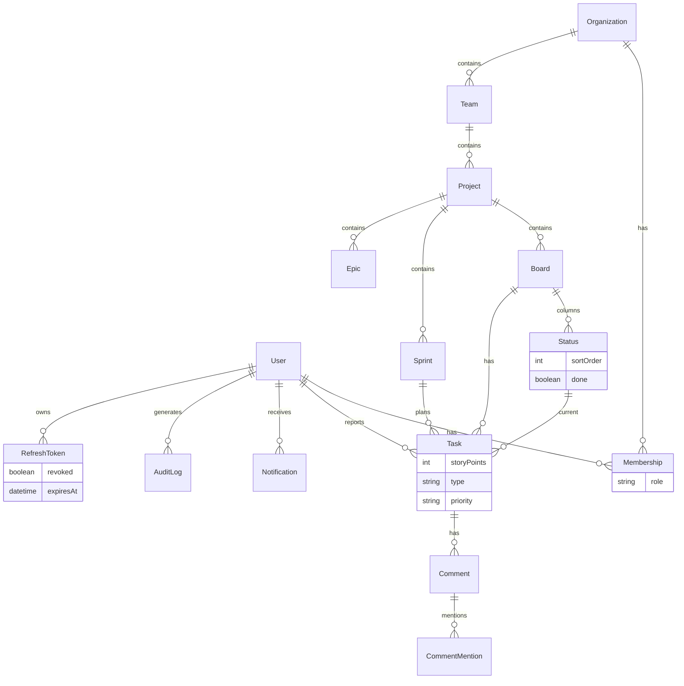

# Sprintly

API backend de board Kanban/sprint. Organização multi-tenant, boards com colunas configuráveis, tarefas, comentários com menção, burndown e notificações assíncronas. Sem frontend neste repo.

**Stack:** Java 21 · Spring Boot 4 · PostgreSQL · RabbitMQ · JWT (access + refresh)

## O que tem

- Multi-tenant por organização (`ADMIN` / `MEMBER`)
- Hierarquia `Organization → Team → Project → Board → Status/Task`
- Status por board, com flag `done` (é o que define “concluído”)
- Sprints + burndown diário
- Comentários com `@email` → menção + notificação
- Audit log de mudança de status
- Auth com access curto e refresh rotacionado

## Arquitetura

```
HTTP (Bearer JWT)
  → Controllers → Services → Repositories (JPA)
                    ├── AuthorizationService  (membership na org)
                    ├── AuditService
                    └── NotificationPublisher
                              │
                              ▼
                         RabbitMQ  →  NotificationConsumer  →  DB
```

Localmente o Compose sobe Postgres (`5433`), RabbitMQ (`5672`, UI em `15672`) e, se quiser, a app (`8081`).

### Modelo de dados



Autorização não usa roles do Spring Security. Sobe a cadeia até a org (`task → board → project → team → organization`) e consulta `Membership`.

## Decisões técnicas

### RBAC em cadeia

Papel vive na organização, não no board.

- Criar org → criador vira `ADMIN`
- Mutações estruturais (team, project, board, status, sprint, membership) pedem admin
- Dia a dia (task, comentário, listagens) pedem só membership

Evita ACL espalhada em cada nível. Modelo mental: você está na org ou não; se está, ou manda nela ou não.

### Status configurável + `done`

Cada board define as próprias colunas (`name`, `sortOrder`, `done`). Não existe status hardcoded — o que conta como pronto é o que o admin marcar via `PATCH /status/{id}/done`.

Burndown e “tarefa concluída” dependem disso. Sem nenhuma coluna `done`, o burndown não queima ponto nenhum.

### Burndown a partir do audit log

Em vez de uma tabela de histórico de story points, o burndown reconstrói o progresso a partir dos `STATUS_CHANGE` em `audit_logs`.

`GET /sprints/{id}/burndown` anda dia a dia no intervalo da sprint, vê se houve transição para um status `done` até aquele dia, e calcula remaining vs linha ideal.

**Trade-off:** uma fonte de verdade (o log), mas o cálculo fica acoplado ao formato de `changes` e ao `storyPoints` *atual* da task — não ao valor no momento da conclusão. Apagar log ou mudar o texto do audit quebra o gráfico. Para o tamanho atual do projeto, a simplicidade vale; em produção séria materializaria eventos de conclusão.

### Refresh token: rotação + sliding expiration

- Access JWT ~15 min (`jwt.access-expiration`)
- Refresh opaco (64 bytes aleatórios), persistido, válido por 30 dias
- Em `POST /auth/refresh`: o antigo é revogado e sai um novo par, com nova data de expiração (sliding)

Ainda não tem logout. Token antigo para de valer na próxima rotação; enquanto estiver válido e não revogado, continua usável.

> Nota: o TTL de 30 dias está hardcoded no `AuthService`. A propriedade `jwt.refresh-expiration` / `JWT_REFRESH_EXPIRATION` existe no Compose/CI, mas o serviço não lê ela ainda.

### Notificações via RabbitMQ

Menção em comentário e mudança de status (task com assignee) publicam em `sprintly.events` (`notification.*`). O consumer grava `Notification` no banco; a API só lê em `GET /notifications`.

Se o Rabbit cair no momento do publish, a request HTTP falha junto — não tem outbox. Aceitável agora; outbox (ou retry) seria o caminho se a entrega precisar ser confiável de verdade.

### `ddl-auto=update`

Schema pelo Hibernate. Ok em dev e no CI com banco fresco. **Não é migração.** Próximo passo óbvio: Flyway ou Liquibase com scripts versionados, e `update` fora de qualquer ambiente compartilhado.

## Endpoints

Base: `http://localhost:8081`  
Auth: `Authorization: Bearer <accessToken>` (exceto `/auth/**`)

### Auth

| Método | Path | |
|--------|------|---|
| POST | `/auth/register` | `email`, `password` → tokens |
| POST | `/auth/login` | idem |
| POST | `/auth/refresh` | `refreshToken` → novo par (rotação) |

### Organização

| Método | Path | |
|--------|------|---|
| POST | `/organizations` | cria org + membership ADMIN |
| GET | `/organizations` | todas as organizações (sem filtro por membership — ver Próximos passos) |
| POST | `/memberships` | admin |
| GET | `/memberships?organizationId=` | |
| POST | `/teams` | admin |
| GET | `/teams?organizationId=` | |
| POST | `/projects` | admin |
| GET | `/projects?teamId=` | |
| POST | `/boards` | |
| GET | `/boards?projectId=` | |

### Board / sprint / task

| Método | Path | |
|--------|------|---|
| POST | `/status` | admin |
| GET | `/status?boardId=` | |
| DELETE | `/status/{id}?boardId=` | admin |
| PATCH | `/status/{id}/done` | `{ "done": true }` |
| POST | `/sprints` | |
| GET | `/sprints?projectId=` | |
| GET | `/sprints/{id}/burndown` | pontos + linha ideal |
| POST | `/tasks` | |
| GET | `/tasks?boardId=` | |
| PATCH | `/tasks/{id}/status` | `{ "statusId": ... }` (+ audit) |
| PATCH | `/tasks/{taskId}/sprint` | `{ "sprintId": ... }` |
| POST/DELETE | `/tasks/{taskId}/labels/{labelId}` | |

### Colaboração

| Método | Path | |
|--------|------|---|
| POST | `/comments` | `@email` gera menção |
| GET | `/comments?taskId=` | |
| GET | `/notifications` | do usuário autenticado |
| GET | `/audit-logs?entityType=&entityId=` | |
| GET | `/audit-logs/{entityType}/{entityId}` | mesma consulta via path |

Também existe `/users` (CRUD básico). Bodies seguem as entidades/DTOs — o caminho mais rápido de explorar ainda é Postman/Insomnia ou pelos testes.

## Como rodar

Precisa de Java 21 e Docker (pro Postgres e Rabbit).

```bash
docker compose up -d postgres rabbitmq
```

Postgres em `localhost:5433`. Rabbit em `5672` (management: `http://localhost:15672`, user/pass `sprintly`).

Defina o segredo JWT:

```powershell
$env:JWT_SECRET="troque-por-uma-chave-longa-e-aleatoria"
```

Suba a API:

```bash
./mvnw spring-boot:run
```

Ou o stack inteiro (`JWT_SECRET` no ambiente / `.env`):

```bash
docker compose up --build
```

API em `http://localhost:8081`. Config base em `application.properties`; no CI/Docker, `SPRING_*` e `JWT_*` sobrescrevem o necessário.

## Testes

```bash
./mvnw test
# ou
./mvnw clean verify
```

| Classe | O que cobre |
|--------|-------------|
| `AuthorizationServiceTest` | admin / member / sem membership |
| `BurndownServiceTest` | total SP, done antes da sprint, sprint inexistente |
| `CommentServiceTest` | menção válida, sem menção, email inexistente |
| `TaskRepositoryTest` | `@DataJpaTest` + H2 — `countByStatusId`, `findByBoardId` |
| `SprintlyApplicationTests` | sobe o contexto |

Serviços com Mockito; repository test usa H2 (não precisa do Postgres local). O smoke da aplicação espera Postgres/Rabbit acessíveis com a config padrão — no CI isso vem dos services do workflow.

## CI/CD

`.github/workflows/ci.yml` (push/PR em `main`):

1. Postgres 16 + RabbitMQ como services
2. Java 21 (Temurin) + cache Maven
3. `./mvnw clean verify`
4. `docker build` da imagem

O `Dockerfile` é multi-stage (Maven → JRE Alpine). Não tem deploy automático — o pipeline para em build + testes + imagem.

## Próximos passos

- Filtrar `GET /organizations` pelas memberships do usuário logado (hoje lista tudo)
- Migrar de `ddl-auto=update` para Flyway/Liquibase
- Swagger/OpenAPI (parar de depender só deste README pro contrato)
- Logout / revoke e **reuse detection** no refresh (token revogado reaparecendo → invalidar a família)
- Anexos em comentários
- Outbox (ou retry) nas notificações
- Materializar eventos de conclusão pro burndown não depender do texto do audit
- Papéis mais granulares (ex.: por projeto), se o multi-tenant crescer

## Estrutura

```
src/main/java/com/mariafernandes/sprintly/
  controller/
  service/        # regras, burndown, authz, consumer Rabbit
  domain/
  repository/
  security/       # JWT filter, JwtService, refresh generator
  dto/
  config/         # RabbitMQ, etc.
```
